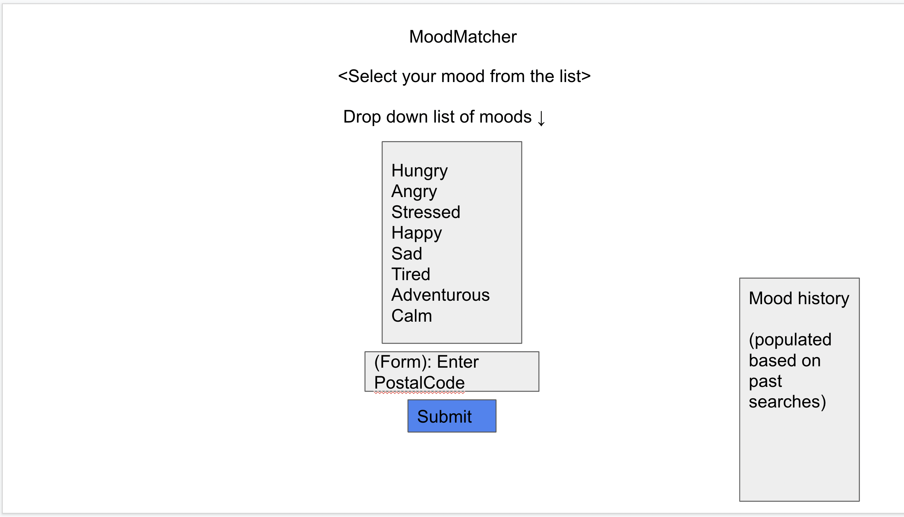
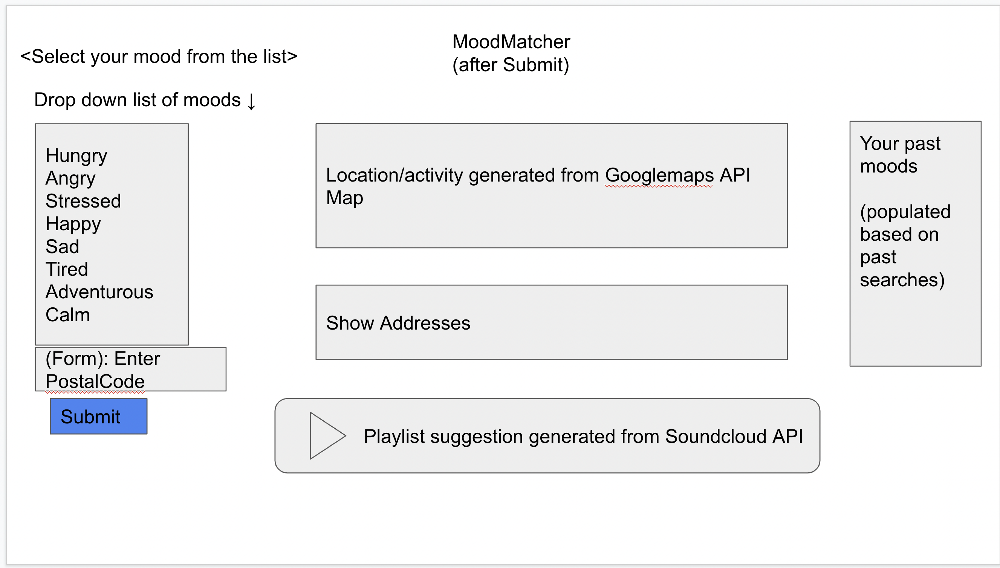

Group 4 Project Proposal

Project Title: Mood Matcher

Project Description: The deployed application will display a list of moods to select from. When the user selects a mood that matches their own and clicks submit, then a map and playlist will be generated suggesting an activity and music for them. Their mood history will be saved on the browser.

User Story: 

As a person who experiences different moods...

I want to find suitable activities and music to match my mood...

So that I can validate/enhance the current mood I am feeling.

Acceptance Criteria:

Given I am a user with a specific mood.

When I select my mood from a list.

Then a suggested activity/place and playlist is generated to best suit my mood.

Given a generated list of activities/locations 

When I click a preferred location from the generated list.

Then I can save the selected item and it is added to a sidebar list accessible at a later time.

Screenshots: 

APIs to be used:

CSS: 
Jquery UI
Googlefonts

Javascript:
Jquery
WebAPI
Moment/Day.js

Serverside:
Googlemaps
Soundcloud

Rough Breakdown of Tasks

- HTML:
- Basic layout 
- Left side including drop down menu
- Middle section - map placeholder and address list
Playlist placeholder
- Right section - mood history section

- StyleSheet:
- Reset.css (if necessary)
- Basic styling for all sections

- Javascript:
- Research API documentations for Googlemaps and Soundcloud
Create functions for API generations
- Create event listeners for buttons
- Write local storage code for moood history section

- Readme

-Tasks Related to Github
Reviewer
